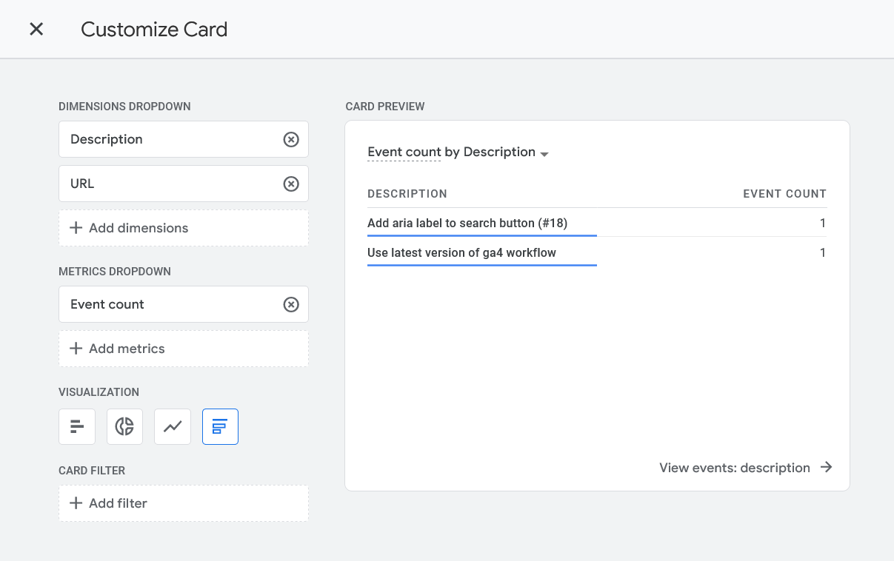
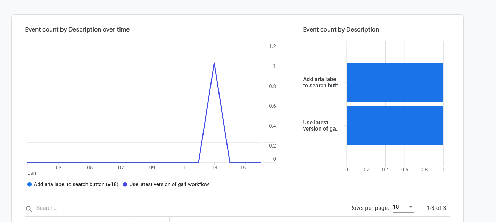

<div align="center">
<h1>Google Analytics 4 GitHub Action</h1>


[](https://github.com/Dylan700/ga4-action/actions/workflows/ci.yaml)
[](https://github.com/Dylan700/ga4-action/actions/workflows/codeql-analysis.yaml)

</div>

<hr>

This action sends offline events to Google Analytics 4 from your repository workflows.

The most common use case is to record deployment events in Google Analytics when updates to your app, website or other system occur. This allows you to attribute changes in other analytics data (such as number of views), against changes in your system (such as a new release or UI update).
</div>

## Table of Contents
1. [Action Inputs](#Inputs)
1. [Example Usage](#Example-usage)
1. [Configuring Service Account Credentials](#configuring-service-account-credentials)
1. [Contributions](#Contributions)

## Inputs

### Summary

| Input | Required | Description | 
| -- | -- | -- |
| event-name | false | The name of the event to record in GA4. |
| measurement-id | true | The [measurement id](https://support.google.com/analytics/answer/12270356?hl=en) for your GA4 property.
| api-secret | true | The API secret for you GA4 property.
| dry-run | false | When `true`, only the validation server will be used to validate the request, and the request will not be sent to your GA4 property.
| property-id | false | The id of you GA4 property. |
| service-account-credentials | false | This variable should be passed as a secret, containing the contents of your Google Cloud service account key file credentials in json format. |

### Detailed Description
#### `event-name`

The name of the event to record in GA4. Default `"update_github"`.

> Please Note: It is usually best to start event names with verbs, and to keep it consistent for reporting purposes in GA4.

All events will contain the description and URL of the commit that triggered the workflow.

#### `measurement-id`

**Required** The [measurement id](https://support.google.com/analytics/answer/12270356?hl=en) for your GA4 property.
>

#### `api-secret`

**Required** The API secret for you GA4 property.

> The API secret can be generated through the GA4 UI.
>
> To create a new secret, navigate in the Google Analytics UI to *Admin > Data Streams > choose your stream > Measurement Protocol > Create*

#### `dry-run`

When true, only the validation server will be used to validate the request, and the request will not be sent to your GA4 property.

#### `property-id`

The id of you GA4 property. If this value is set, the action will configure custom dimensions to make viewing event data easier.

> If property-id is defined, you must also provide service account credentials.

> Note: the property id is not the same as your tracking id! It is a number that can be found in *Admin > Property Settings > Top left corner*

#### `service-account-credentials`

This variable should be passed as a secret, containing the contents of your Google Cloud service account key file credentials in json format.

> Defining the `property-id` and `service-account-credentials` arguments will allow custom dimensions to be automatically configured in your GA4 property. Configuring these dimensions will allow you to view your event data in reports Please see below to configure this correctly.

## Configuring Service Account Credentials

In order to use the functionality of auto-configured custom dimensions, a service account needs to be created. Follow the steps below:

1. Login to [Google Cloud](https://console.cloud.google.com).
2. Create a new cloud project or use an existing one.
3. Once your project is selected, in the side-bar select *IAM & Admin*.
4. Navigate to *Service Accounts*.
5. Create a new service account and download the credentials as a json file.
6. Copy the contents of the json file into a GitHub secret.
7. Enable the Google Analytics Admin API for your project in Google Cloud to grant the service account access to the API.
8. Open your GA4 property and add the service account (via the generated email) to your property with editor privileges.

## Example usage

```yaml
uses: Dylan700/ga4-action@latest
with:
  event-name: update_website
  measurement-id: ${{secrets.ga4_measurement_id}}
  api-secret: ${{secrets.ga4_api_secret}}
```

You can view your GitHub Events using the realtime view, or if you've enabled autoconfigured dimensions, you can view by description and url, or create a custom card.



## Contributions
Contributions are welcome! If you have something to add or fix, just make a pull request to be reviewed.